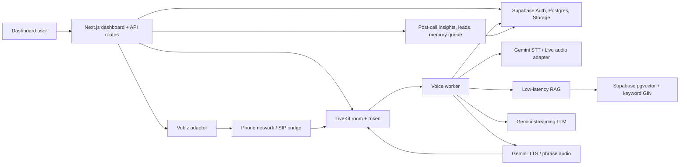

# Vaani AI Voice

Vapi-style AI voice agent MVP built with Next.js, Supabase, pgvector, LiveKit, Gemini, and a clean Vobiz telephony adapter.

Production URL: [https://vaanivoice.netlify.app](https://vaanivoice.netlify.app)

The home page also includes a public sample-call funnel: enter a name, phone number, choose one of three demo agents, and Vaani calls the number with an AI receptionist-style experience.

## Architecture



## What Works

- Public marketing/demo page at `/` with Dental Reception, Real Estate Qualifier, and Restaurant Host sample agents.
- Agent creation and editing from `/dashboard/agents/new` and `/dashboard/agents/[id]`.
- Prompt/context, language, voice, cost, latency, barge-in, filler, Vobiz, and end-call configuration.
- Knowledge upload for PDF, DOCX, TXT, CSV, XLSX with pre-call parsing, chunking, summaries, keywords, embeddings, and pgvector storage.
- Hybrid retrieval RPC with vector similarity, keyword rank, metadata filtering by `agent_id`, and top-K prompt packing.
- Outbound call API creates a call row, LiveKit room, and asks the Vobiz provider to start a call.
- Public demo calls use Vobiz XML callbacks for answer, speech gather, follow-up turns, hangup, transcript storage, latency/cost estimates, and post-call insights.
- Live transcript, call history, insights, lead extraction, unanswered questions, memory, and suggested-learning approval pages.
- Post-call Gemini analysis writes insights, leads, learning suggestions, unanswered questions, and call summaries after hangup.
- LiveKit token API and a voice worker pipeline for transcript-driven local testing.

## Provider Notes

Vobiz-specific behavior is isolated in [`lib/telephony/vobiz.ts`](./lib/telephony/vobiz.ts).

Implemented:

- XML outbound call creation through `/Account/{VOBIZ_AUTH_ID}/Call/`.
- `X-Auth-ID` and `X-Auth-Token` auth headers.
- Public demo callback URLs for answer, ring, gather, and hangup.
- Generic webhook handler with signature verification when `VOBIZ_WEBHOOK_SECRET` is set.

Still provider-specific:

- SIP trunk and LiveKit bridge fields.
- Webhook event names and payload mapping.
- Signature header and HMAC format.

No fake production endpoints are hardcoded. Dashboard real-time LiveKit calls still need the exact Vobiz SIP-to-LiveKit bridge mapping or a configured LiveKit SIP trunk.

## Low-Latency RAG

- Documents are parsed and embedded during upload, never during calls.
- Chunks target roughly 500 to 900 tokens with overlap.
- CSV/XLSX rows are preserved as table-like text with sheet/row references.
- `agent_knowledge_chunks` stores content, summary, keywords, source reference, token count, and a `vector(768)` embedding.
- `match_agent_knowledge` ranks vector similarity and keyword score, scoped by `agent_id`.
- The live voice pipeline prefetches retrieval on partial transcripts and reranks on final transcripts.
- Retrieved context is capped and compressed before Gemini prompting.

## Setup

1. Install dependencies:

```bash
npm install
```

2. Copy env vars:

```bash
cp .env.example .env
```

3. Fill Supabase, Gemini, LiveKit, and Vobiz env vars.

For local demo mode, leave provider env vars empty or set:

```bash
VAANI_DEMO_MODE=true
```

For production or real-provider testing, set:

```bash
VAANI_DEMO_MODE=false
NEXT_PUBLIC_SUPABASE_URL=...
NEXT_PUBLIC_SUPABASE_ANON_KEY=...
SUPABASE_SERVICE_ROLE_KEY=...
GEMINI_API_KEY=...
LIVEKIT_URL=...
LIVEKIT_API_KEY=...
LIVEKIT_API_SECRET=...
VOBIZ_API_KEY=...
VOBIZ_BASE_URL=...
VOBIZ_AUTH_ID=...
VOBIZ_AUTH_SECRET=...
VOBIZ_WEBHOOK_SECRET=...
VOBIZ_PHONE_NUMBER=...
VOBIZ_OUTBOUND_CALL_PATH=...
VOBIZ_HANGUP_CALL_PATH=...
DEFAULT_FROM_NUMBER=...
NEXT_PUBLIC_APP_URL=...
```

4. Apply Supabase migrations:

```bash
supabase db push
```

5. Seed a demo agent when Supabase is configured:

```bash
npm run seed
```

6. Start the app:

```bash
npm run dev
```

Open [http://localhost:3000](http://localhost:3000).

## Netlify Deployment

The repo includes `netlify.toml` and `@netlify/plugin-nextjs`.

1. Push this repo to GitHub.
2. In Netlify, import the GitHub repo.
3. Use `npm run build` as the build command. Netlify will read the publish/plugin settings from `netlify.toml`.
4. Add the production environment variables from `.env.example`.
5. Set `NEXT_PUBLIC_APP_URL=https://vaanivoice.netlify.app` and redeploy.

For the real-time voice worker, use an always-on host such as DigitalOcean App Platform, Fly.io, Render, or a small VM. Keep LiveKit Cloud; do not run the LiveKit media server yourself for this MVP unless you need custom networking or volume pricing later.

## Public Sample Call

The public sample call requires a public HTTPS deployment because Vobiz must reach callback URLs.

```bash
curl -X POST https://vaanivoice.netlify.app/api/public/demo-call \
  -H "content-type: application/json" \
  -d '{
    "name": "Rahul",
    "phone_number": "+919000000000",
    "scenario": "dental",
    "use_case": "I want to book a cleaning and ask about tooth sensitivity."
  }'
```

Accepted scenarios are `dental`, `real_estate`, and `restaurant`.

## Local Demo Mode

If Supabase/Gemini/LiveKit/Vobiz env vars are empty, the app still runs with built-in demo data. Provider-backed operations return clear demo/configuration responses instead of failing the UI.

Production mode does not silently authenticate as the demo user. When `VAANI_DEMO_MODE=false`, Supabase Auth is required.

Provider readiness:

```bash
curl http://localhost:3000/api/health
```

## Test Call Flow

1. Sign in at `/login`.
2. Create or open `Sales Demo Agent`.
3. Paste or edit context.
4. Upload a PDF, Excel, CSV, DOCX, or TXT file.
5. Start an outbound test call from the agent page.
6. Backend creates a LiveKit room and call row.
7. Backend calls the Vobiz adapter.
8. Voice worker joins the room and handles transcript turns.
9. Dashboard shows transcript and metrics.
10. End the call through `/api/calls/end`.
11. Post-call analysis extracts summary, intent, sentiment, outcome, leads, questions, answers, objections, and suggested learnings.
12. Approve learnings in `/dashboard/memory`; approved memory is used in future calls.

For a quick public demo, use `/`, submit the sample-call form, answer the Vobiz call, and then inspect the stored call from `/dashboard/calls`.

## Data Export And Deletion

Export a complete call bundle:

```bash
curl http://localhost:3000/api/calls/<call-id>/export
```

Delete a call and its dependent transcript, metrics, insights, leads, unanswered questions, and references:

```bash
curl -X DELETE http://localhost:3000/api/calls/<call-id>
```

The dashboard call detail page also exposes Export and Delete controls.

## Voice Worker

Run a local transcript-driven worker:

```bash
VOICE_WORKER_USER_ID=<user-id> \
VOICE_WORKER_AGENT_ID=<agent-id> \
VOICE_WORKER_CALL_ID=<call-id> \
VOICE_WORKER_ROOM_NAME=<livekit-room> \
npm run worker:voice
```

Publish LiveKit data messages with topic `partial-transcript` for prefetch and `final-transcript` for response generation. The pipeline stores messages, references, and metrics.

## Cost Controls

- Economy mode defaults to short history, top-3 RAG, compact prompts, and low-cost Gemini models.
- Post-call analysis runs after hangup, not during the live call.
- Estimated per-turn and per-call cost is stored in `call_metrics` and surfaced in the dashboard.
- Re-embedding is avoided unless files are uploaded again.

## Security

- Service-role key is server-only.
- API routes use server-side auth and input validation.
- Supabase RLS policies isolate every user-owned table.
- Vobiz webhooks verify signatures when `VOBIZ_WEBHOOK_SECRET` is set.
- Storage is private and uploads go through authenticated API routes.
- Supabase session middleware refreshes cookies and guards dashboard pages.
- LiveKit token minting checks that the requested room belongs to the current user.
- Knowledge uploads validate extension and enforce a 25 MB limit.

## Needed For Real Call Testing

Send these when ready:

- Supabase project ref, URL, anon key, and service-role key.
- Gemini API key.
- LiveKit URL, API key, and API secret.
- Vobiz API documentation or sample curl for outbound calls.
- Vobiz webhook sample payloads for inbound, ringing, answered, completed, failed, and recording-ready events.
- Vobiz webhook signature header/HMAC rule.
- SIP trunk or bridge details for connecting Vobiz audio into LiveKit.
